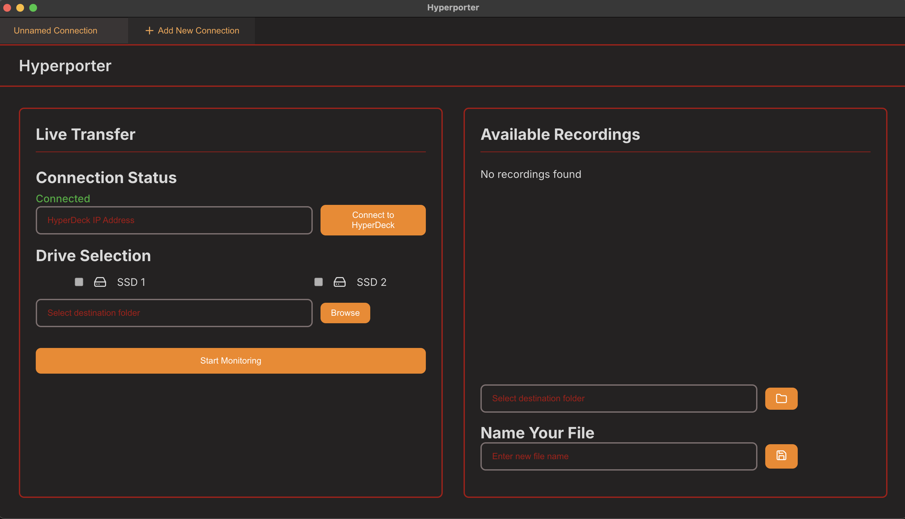
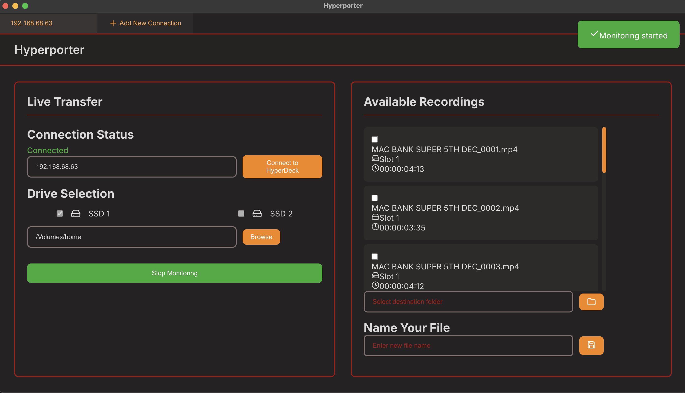

# Hyperporter

Hyperporter is a cross-platform desktop application designed to streamline the management and transfer of recordings from Blackmagic HyperDeck devices. It provides real-time monitoring of recordings and facilitates easy file transfers via RTSP streaming.
It allows concurrent recording to any device on your network as well as the physical SSD on your HyperDeck device.
Thus speeding up the transfer process of recordings from the Hyperdeck to your users, clients, networked devices.

NOTE, the live recording monitoring functionality is only supported on HyperDeck Studio HD + Pro models.

## Features

- Real-time monitoring of HyperDeck recordings
- RTSP streaming support for file transfers
- Ability to monitor multiple HyperDecks simultaneously
- Multi-platform support (macOS, Windows, Linux)
- Simple and intuitive user interface
- Live transfer status updates
- File renaming capabilities
- Support for multiple SSD monitoring

## Screenshots

## Installation

Download the appropriate version for your operating system:

### macOS
- Download the `.dmg` file
- Open the `.dmg` file
- Drag Hyperporter to your Applications folder
- Right-click and select "Open" when launching for the first time

## Usage

1. Launch Hyperporter
2. Enter your HyperDeck's IP address
3. Select which SSD(s) to monitor
4. Choose a destination folder for recordings
5. Click "Start Monitoring"
6. Record on your HyperDeck as normal
7. Stop monitoring when finished
8. Optionally rename your transferred files

## System Requirements

- HyperDeck Studio with firmware supporting RTSP
- Network connection to HyperDeck
- Operating System:
  - macOS 10.15 or later
  - Windows 10 or later
  - Linux (modern distributions)

## Version History

- 1.1.0
  - Initial release
  - Basic monitoring and transfer functionality
  - Cross-platform support

## Future planned release updates
- Intergration with Companion software
- Expanding to include AJA range of pro recorders

## License

ISC License

## Support

For support, please contact bt@oncuecreative.com or https://github.com/BPT1901

## Acknowledgments

- Blackmagic Design for HyperDeck API documentation
- Electron.js community
- React.js community
